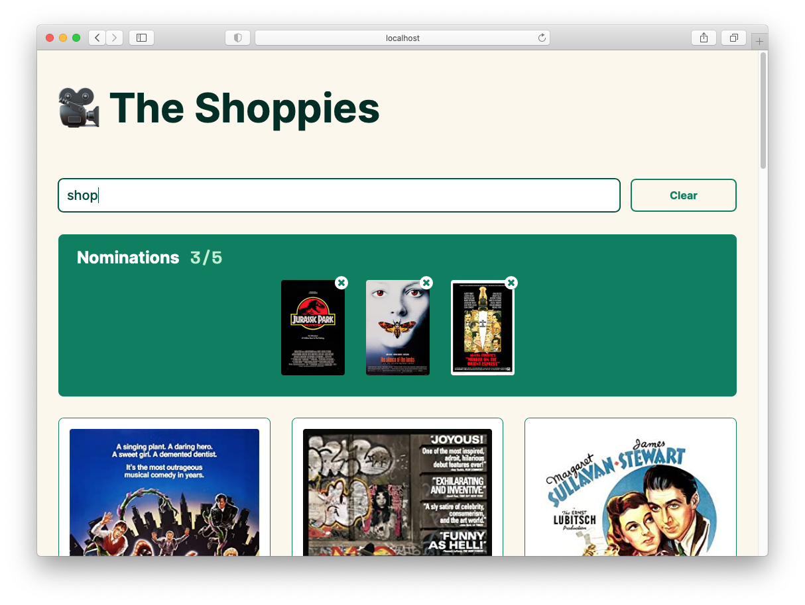

# 🎥 The Shoppies
***A Frontend Developer challenge by Jason Florentino***

## [🔗 View Deployed Version](https://theshoppiesjason.netlify.app/)
Created during the evenings after work over the span of a few days, this is my submission for Shopify's Frontend Intern Challenge. Given the limited timing, I tried to balance the creation of a simple, but pleasing design, with the addition of some extra features to improve the user experience. Those extras include: Responsive layout; State persistance using local storage; Loading, empty, and error states; Pagination for search results.

## 🎯 The Challenge
Create a webpage that can search OMDB for movies, and allow the user to save their favourite films they feel should be up for nomination. When they've selected 5 nominees they should be notified they're finished.

We'd like a simple to use interface that makes it easy to:
- Search OMDB and display the results (movies only)
- Add a movie from the search results to our nomination list
- View the list of films already nominated
- Remove a nominee from the nomination list

## ⚙️ Technical requirements
1. Search results should come from OMDB's API.
2. Each search result should list at least its title, year of release and a button to nominate that film.
3. Updates to the search terms should update the result list.
4. Movies in search results can be added and removed from the nomination list.
5. If a search result has already been nominated, disable its nominate button.
6. Display a banner when the user has 5 nominations.

## 🖼 Snapshot

Thanks for visiting!

—Jason (May 2021)
